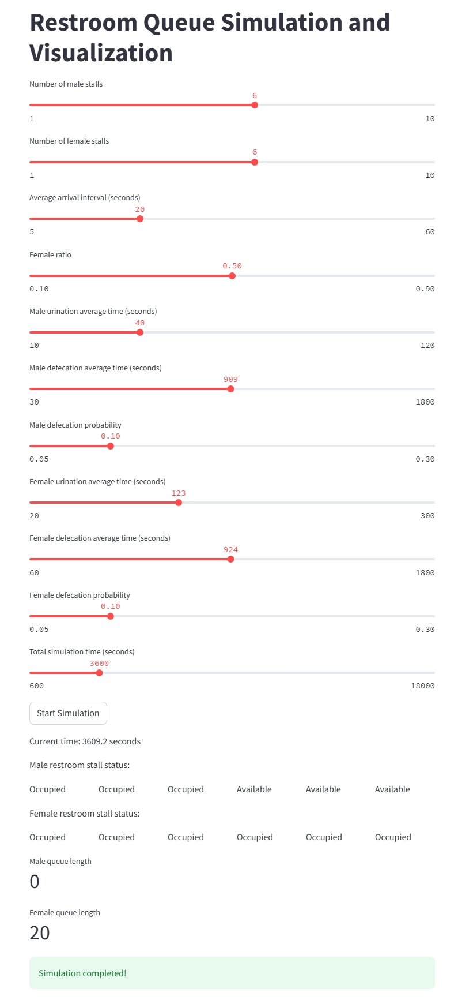
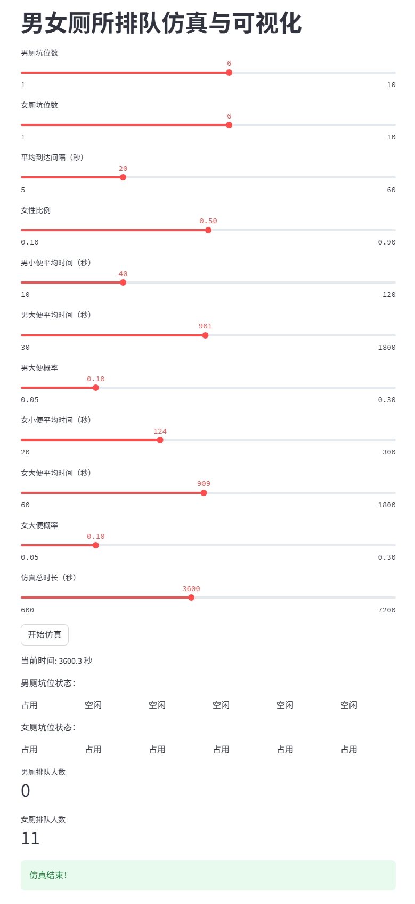

# Simulation and Visualization of Male and Female Restroom Queues

This simulation project aims to model and visualize the queuing phenomenon in male and female restrooms, providing an intuitive tool to analyze and understand the dynamics of public restroom usage. By adjusting various parameters, users can observe queuing behavior and waiting time distributions under different conditions. This not only supports academic research and assists public facility managers in optimizing restroom design and allocation but also offers an engaging interactive experience for general users.

In modern society, the design and management of public restrooms is a critical public service issue. Especially in high-traffic areas such as large events, shopping malls, and transportation hubs, well-planned restroom facilities can significantly enhance user experience and operational efficiency. This project leverages simulation technology to help users explore how restroom usage dynamically changes with varying gender ratios, arrival rates, and toilet usage durations.

Whether you are a researcher, facility manager, or simply an individual interested in queuing theory, this simulation project offers valuable insights and data-driven support. We welcome you to explore, use, and share your findings!

This project simulates and visualizes restroom queue behavior based on queuing theory, helping to explain why queues are more common in women's restrooms.

[中文文档](README-zh.md)

## Features

* Supports customizable parameters such as number of stalls for men and women, arrival distribution, toilet usage time, and probabilities of different usage types
* Visualized distribution of waiting times for men and women
* Interactive parameter adjustment

## Latest Updates
### Time Variation Control Feature
* Added random variation control for toilet usage time
* Toggle on/off time variation
* Uses normal distribution to model time variations
* Adjustable standard deviation (1-30 seconds)
* Maintains average usage time while changing the dispersion of time distribution
* Ensures no negative time values

## Demo Illustration
<p align="center">
  
  
</p>

## Installation

```bash
pip install -r requirements.txt
```

## How to Run

```bash
streamlit run app.py
```

## File Description

* `toilet_sim.py`: Core simulation logic
* `app.py`: Streamlit frontend and visualization
* `requirements.txt`: Dependency list

## Possible Extensions

* Support for time-varying arrival rates
* More diverse toilet usage behaviors
* Modeling of restroom cleaning/maintenance periods
* Support for additional time distribution types (e.g., Gamma, Weibull distributions)
* More random variation control parameters

Feel free to reach out if you have any questions or would like to contribute!